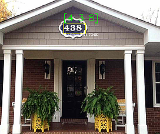
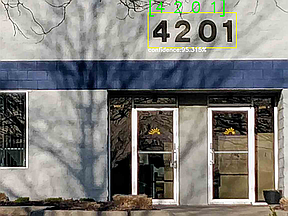
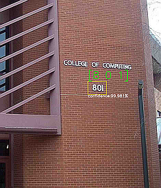
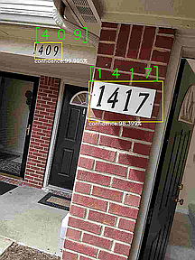

# Classification and Detection with Convolutional Neural Networks
Four digit(horizontal) sequence prediction with CNN using Keras with TensorFlow backend

  

## Abstract:
Automatic detection of digits and numbers is a task where recent work in neural networks and computer vision has shown a lot of promise. 
The goal of this project is to replicate earlier results [2][1] using multiple Convolutional Neural Network (CNN) 
models to predict a sequence of numbers. The Street View House Number (SVHN) data set which has ~250,000 labelled images were used 
in this study. About 150,000 samples from this dataset were used to train three different CNN models: designed architecture, VGG-16,
Pre-Trained VGG-16 to predict a sequence of up to four digits. 

### Video Results (Click image to view demo on YouTube)
 Detection using CNN")

https://www.youtube.com/watch?v=ZDRt21VEOpA "SVHN Detection using CNN")

The reported train and test sequence accuracies are 91.53% Train and
85.4% Test for own architecture, 96.6% Train and 91.24% Test for Pre-Trained VGG-16, 90.8% and 82.1% train and test accuracies for 
the VGG-16 model. The bench mark is a reported 96% test accuracy on the entire data set [1]. The pre-trained VGG-16 model which uses 
the ‘ImageNet’ weights showed the best accuracy. This model is tested on real-life detection scenarios using a 10-level
image pyramid with sliding window detection to tackle digit sequence variance with size and scale. Ian GoodFellow's Reference Paper https://arxiv.org/pdf/1312.6082.pdf

#### Dataset 
The original stanford dataset has been reformatted from the '.mat' to '.h5' format for easier access 
The reformatted data used (in helper.prepDataForCNN) can be downloaded from 
###### https://my.pcloud.com/publink/show?code=kZsxCO7ZdnzmYqXWO6ydqkC5kz114f5zUUaV  (Reformatted .h5)
###### http://ufldl.stanford.edu/housenumbers/ (Original .mat)

#### Models
##### https://my.pcloud.com/publink/show?code=kZsPnA7ZuMoiRGBAw0X4k7lGrU2CyFH2liey (Pretrained VGG and designed)

## Designed Architecture

## Performance Analysis

#### Model	      TrainLoss	TestLoss	ValLoss	TrainSeq.Accuracy%	ValSeq.Accuracy%	TestSeq.Accuracy%

VGGPreTrain	  0.17	    0.76	    0.88	  96.62	            87.91	            91.24

VGG16 	      0.49	    1.10	    0.9	    90.8	            86.87	            82.16

Designed	    0.41	    0.87	    0.75	  91.53	            87.99	            85.40

##### More details https://github.com/beeps82/SVHN_CNN/blob/master/Report.pdf
